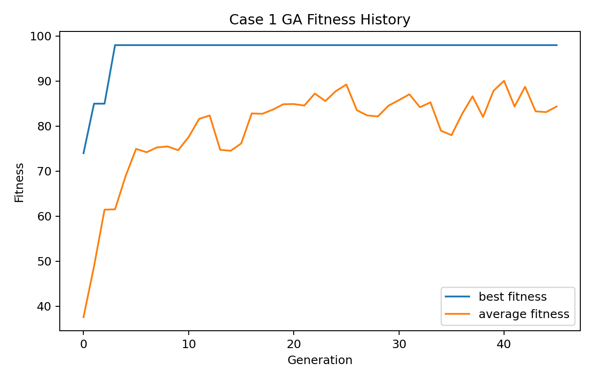
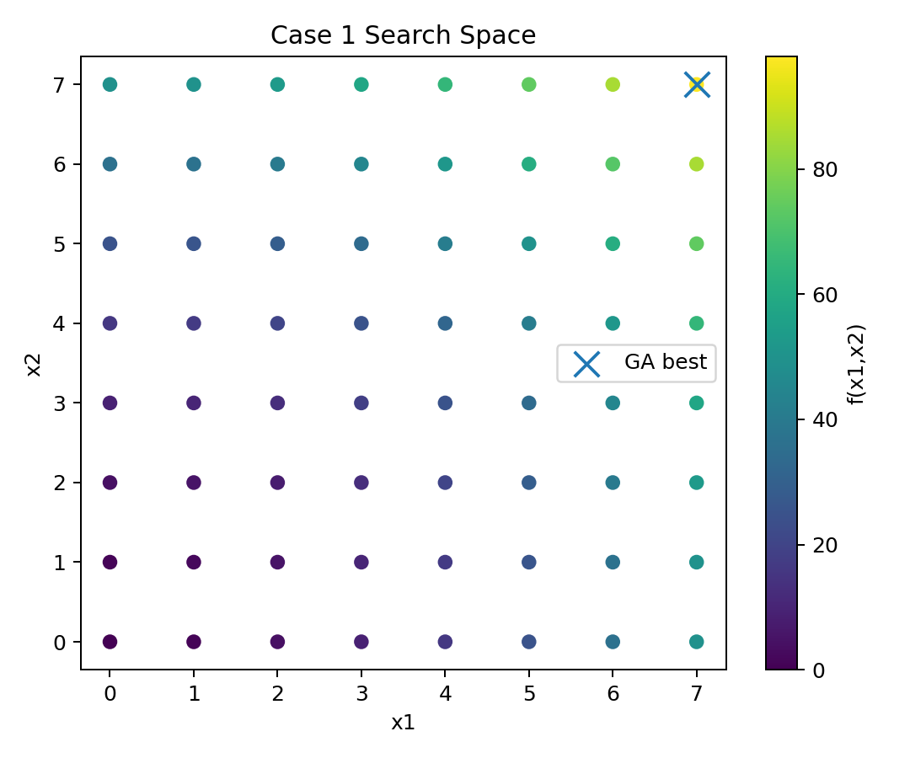
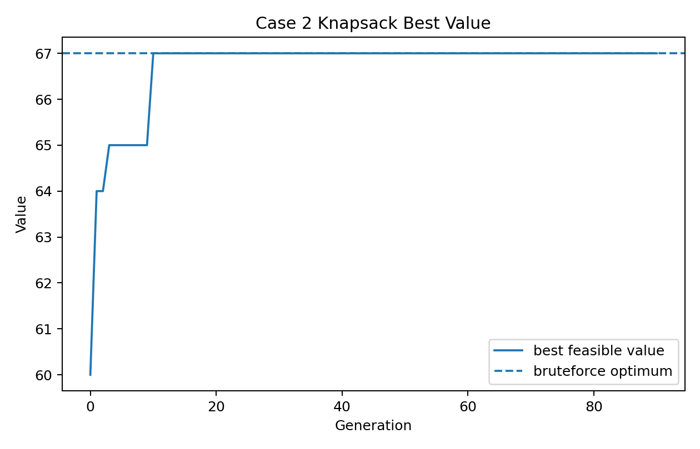
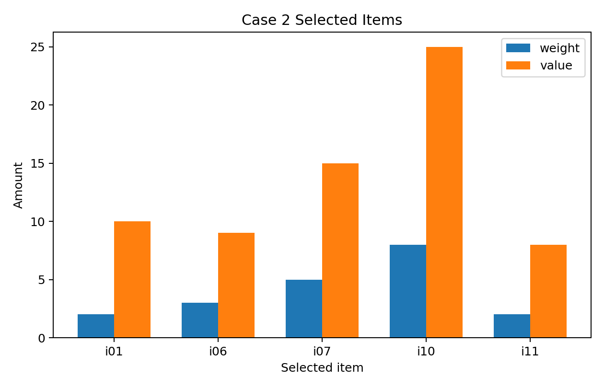
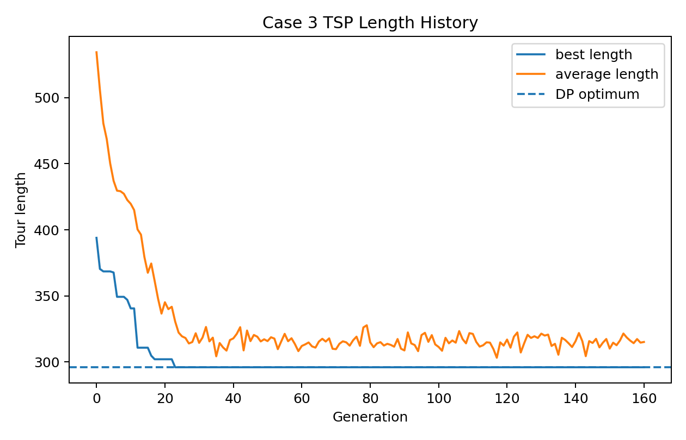
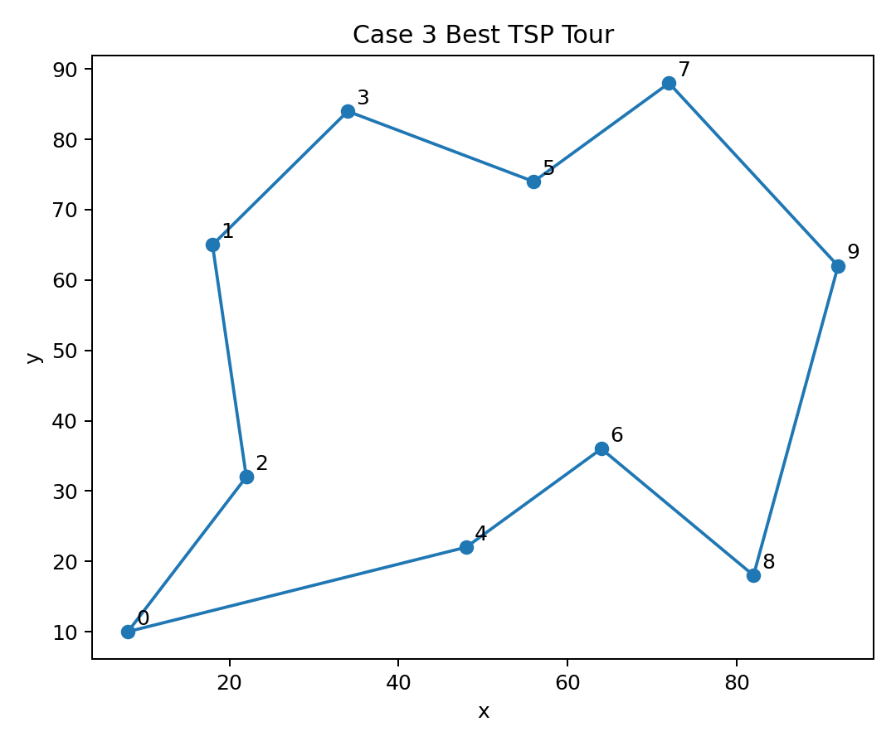

# 遗传算法入门：从函数优化到组合优化
<!-- QmdTool: no-auto-includes -->

本教材面向零基础读者，用三个可运行案例解释遗传算法的基本思想。第一章从二进制编码的函数最大化开始，第二章进入带约束的 0-1 背包，第三章转向需要排列编码的 TSP。正文中的来源标注采用 `source_md/pdfXXX.md:Lx-Ly` 形式；案例数值来自同一工作区中实际运行的 `code/*/results/*.json` 与 `*.csv` 文件。

## 1. 从函数最大化问题认识遗传算法

### 1.1 本章要解决的问题

遗传算法（Genetic Algorithm, GA）可以先被理解为一种“把候选解当作可进化个体”的搜索方法。原材料把遗传算法定义为一种模拟自然环境中遗传与进化过程的自适应全局优化概率搜索算法，并把一般最大化问题写成“在可行解集合内寻找使目标函数最大的决策变量”的形式。[来源：source_md/pdf024.md:L278-L288]

本章不从复杂术语开始，而是从一个可以完全看见搜索空间的小问题开始：

$$
\max f(x_1,x_2)=x_1^2+x_2^2, \qquad x_1,x_2\in\{0,1,\ldots,7\}.
$$

这个例子故意很小，因为它的重点不是证明遗传算法比穷举更快，而是把“编码、种群、适应度、选择、交叉、变异”六个概念串成一个完整流程。原材料中也使用了 $x_1,x_2\in[0,7]$ 的二进制编码示例，并指出 6 位无符号二进制串可以表示一个可行解，例如 `101110` 对应 $[5,6]^T$。[来源：source_md/pdf024.md:L388-L392]

### 1.2 从表现型到基因型：为什么要编码

优化问题中的真实决策变量叫作**表现型**。在上面的函数优化中，表现型就是 $(x_1,x_2)$。遗传算法内部操作的通常不是表现型本身，而是某种**基因型**。在本章案例中，每个变量用 3 位二进制表示：

$$
0\mapsto 000,
\quad
1\mapsto 001,
\quad
\ldots,
\quad
7\mapsto 111.
$$

于是，一个候选解 $(x_1,x_2)$ 可以写成 6 位染色体：

$$
\underbrace{b_1b_2b_3}_{x_1}\underbrace{b_4b_5b_6}_{x_2}.
$$

例如：

$$
101110 \Rightarrow x_1=5,\;x_2=6,\; f(5,6)=25+36=61.
$$

编码的意义在于：算法可以用统一的方式对符号串做选择、交叉和变异。原材料也强调，应用遗传算法时需要确定染色体编码方法、解码方法、适应度评价方法、遗传算子和运行参数，其中编码方法和遗传算子的设计是关键步骤。[来源：source_md/pdf024.md:L688-L698]

### 1.3 种群：不是一个点，而是一组候选解

普通局部搜索常从一个当前解出发，逐步移动到另一个解。遗传算法更像同时维护一组候选解，这组候选解称为**种群**。原材料也指出，遗传算法的操作对象是一组可行解，而非单个可行解，因此搜索轨道有多条。[来源：source_md/pdf032.md:L166-L172]

本章程序设定如下：

| 参数 | 取值 | 含义 |
|---|---:|---|
| population_size | 24 | 每代个体数量 |
| generations | 45 | 最大进化代数 |
| crossover_rate | 0.85 | 两个父代发生交叉的概率 |
| mutation_rate | 0.03 | 每个二进制位发生变异的概率 |
| seed | 20260500 | 固定随机种子，保证结果可复现 |

在第 0 代，算法随机产生 24 条 6 位染色体。每条染色体解码成一个 $(x_1,x_2)$，再计算函数值。因为本章目标是求最大值，并且函数值非负，所以可以直接令适应度等于目标函数值。原材料在类似情形中也说，当目标函数总取非负值且目标是最大化时，可直接利用目标函数值作为个体适应度。[来源：source_md/pdf024.md:L392-L398]

### 1.4 选择、交叉、变异：一次进化循环

遗传算法的一代更新通常包含六步：初始化、个体评价、选择、交叉、变异和终止判断。原材料给出的流程也是：生成初始群体，计算适应度，执行选择、交叉和变异，得到下一代群体，再根据终止条件决定继续或输出最优个体。[来源：source_md/pdf024.md:L362-L374]

在本章案例里，一次更新可以这样理解：

**选择**：适应度越高的个体越容易成为父代。若个体 $i$ 的适应度为 $F_i$，则比例选择中的选择概率可以写成：

$$
p_i=\frac{F_i}{\sum_j F_j}.
$$

原材料对比例选择也采用了类似思想：先求总适应度，再计算每个个体的相对适应度 $f_i/\sum f_i$，作为其被遗传到下一代的概率。[来源：source_md/pdf024.md:L398-L400]

**交叉**：两个父代交换部分片段。例如，若在第 3 位后发生单点交叉：

```text
父代 A: 101|110
父代 B: 011|001
子代 1: 101|001
子代 2: 011|110
```

原材料把单点交叉称为常用而基本的交叉操作：随机配对、随机设置交叉点，然后按交叉概率交换部分染色体。[来源：source_md/pdf024.md:L647-L657]

**变异**：以较小概率把某一位从 0 改成 1，或从 1 改成 0。原材料也把基本位变异描述为对二进制编码中某个基因座的取反操作。[来源：source_md/pdf024.md:L663-L670]

### 1.5 案例结果：从随机种群逼近最优解

本章代码实际运行后得到的最优染色体为 `111111`，解码得到：

$$
x_1=7,\qquad x_2=7,\qquad f(x_1,x_2)=98.
$$

由于搜索空间只有 $8\times8=64$ 个点，本例可以直接验证全局最优解也是 $(7,7)$，目标函数值为 98。第 0 代的最佳个体为 `101111.0`，对应 $(x_1,x_2)=(5,7)$，适应度为 74；到第 3 代，算法已经找到 `111111`，之后精英保留机制使该最好结果持续保留。



图中折线显示了最佳适应度和平均适应度的变化。最佳适应度很快到达 98，而平均适应度逐步上升，说明种群中的普通个体也逐渐向高适应度区域集中。



第二张图把完整搜索空间画出来，并标出最终找到的点。这个小例子揭示了遗传算法的基本直觉：它不需要事先知道函数的梯度，只需要能评价每个候选解的好坏，就可以通过“保留较好个体、重组已有片段、偶尔产生小扰动”的方式推进搜索。

### 1.6 本章小结

1. 遗传算法把可行解编码为染色体，再对染色体组成的种群进行迭代。
2. 表现型是问题中的实际解，基因型是算法内部操作的符号串。
3. 适应度是选择压力的来源：适应度越高，个体越容易把信息传到下一代。
4. 交叉负责重组已有结构，变异负责引入局部扰动。
5. 本章案例中，程序从随机初始种群出发，在第 3 代找到全局最优解 $(7,7)$。

### 1.7 思考题

1. 如果把变异率从 0.03 提高到 0.30，种群更容易探索新区域，但为什么也可能更难稳定收敛？
2. 本章函数很简单，可以穷举全部 64 个点。为什么教材仍然用它讲遗传算法？
3. 如果目标函数可能为负数，为什么不能总是直接令 $F(X)=f(X)$？

## 2. 适应度、选择压力与 0-1 背包

### 2.1 为什么第二章换成背包问题

第一章的函数优化中，所有候选解都是合法的：任意 6 位二进制串都能解码成 $(x_1,x_2)$。但很多工程问题不是这样。一个候选解即使看上去有较高收益，也可能违反约束。0-1 背包就是最典型的入门例子。

原材料把背包问题描述为：从多个物品中选择若干件放入背包，在不超过背包承受重量的前提下，使装入物品的价值最大。[来源：source_md/pdf026.md:L1712-L1718] 对于每个物品 $j$，定义 0-1 决策变量：

$$
x_j=\begin{cases}
1,&\text{选择物品 }j,\\
0,&\text{不选择物品 }j.
\end{cases}
$$

原材料也使用了这个建模方式：若项目 $j$ 被选择，则 $x_j=1$；否则 $x_j=0$。[来源：source_md/pdf026.md:L1720-L1738]

### 2.2 数学模型：价值最大，但重量不能超限

设物品 $j$ 的重量为 $w_j$，价值为 $c_j$，背包容量为 $W$。0-1 背包可以写成：

$$
\max \sum_{j=1}^{n} c_jx_j
$$

$$
\text{s.t.}\quad \sum_{j=1}^{n} w_jx_j\le W,\qquad x_j\in\{0,1\}.
$$

这类模型很适合作为遗传算法的第二个案例，因为染色体天然可以是一串 0 和 1：第 $j$ 位为 1 表示选择第 $j$ 个物品，第 $j$ 位为 0 表示不选择。

### 2.3 约束与适应度：不能只看价值

如果只把总价值当作适应度，算法可能偏好“把所有高价值物品都放进去”的染色体，即使它严重超重。因此，本章采用一个简单的惩罚式适应度：

$$
F(X)=\begin{cases}
V(X), & W(X)\le W,\\
\max(0, V(X)-\lambda(W(X)-W)), & W(X)>W,
\end{cases}
$$

其中 $V(X)$ 是总价值，$W(X)$ 是总重量，$\lambda$ 是超重惩罚系数。

这一步与原材料中“必须预先确定由目标函数值到个体适应度之间的转换规则”的思想一致。原材料还特别提醒，比例选择要求适应度为非负数，因此不能在所有情况下都直接使用原始目标函数值。[来源：source_md/pdf024.md:L574-L590]

### 2.4 案例设置与运行结果

本章案例设置了 12 个物品，背包容量为 20。程序固定随机种子 20260518，运行后得到的最佳染色体为：

```text
100001100110
```

它选择了以下物品：

| item_id   |   weight |   value |
|:----------|---------:|--------:|
| i01       |        2 |      10 |
| i06       |        3 |       9 |
| i07       |        5 |      15 |
| i10       |        8 |      25 |
| i11       |        2 |       8 |

总重量为 20，正好不超过容量 20；总价值为 67。为了检查这个教学案例的正确性，程序还对全部 $2^{12}=4096$ 种组合做了穷举验证，穷举得到的最优价值同样为 67，对应染色体也是 `100001100110`。因此，本次遗传算法运行找到了该小规模案例的全局最优解。



图中可以看到，第 0 代最佳可行价值为 60，第 10 代达到 67。此后，精英保留使最佳可行解维持不变。



这张图把最终选择的物品按重量和价值画出。对于初学者来说，它的意义在于：染色体中的 1 并不是抽象符号，而是一个明确的选择动作。

### 2.5 选择压力：为什么适应度设计会影响搜索行为

选择压力可以粗略理解为：优秀个体比普通个体多得到多少繁殖机会。压力太小，算法接近随机游走；压力太大，早期偶然出现的较好个体可能迅速占满种群，使多样性下降。原材料在高级讨论中也提醒，选择压过大可能导致少数较好但未必全局最优的解迅速占据种群；选择压过小则可能使算法呈现随机徘徊。[来源：source_md/pdf032.md:L192-L202]

背包问题比第一章案例更能展示这一点：如果惩罚太轻，超重个体会长期占优势；如果惩罚太重，算法可能过度偏好很轻但价值一般的组合。适应度不是一个机械公式，而是把“问题目标”和“可行性约束”翻译成进化选择的桥梁。

### 2.6 本章小结

1. 0-1 背包可以直接用二进制染色体表示，每一位对应一个物品是否被选择。
2. 有约束问题不能只看目标值，还要处理不可行解。
3. 惩罚式适应度是一种简单处理方式，但惩罚系数会影响搜索行为。
4. 本章程序在第 10 代达到最佳可行价值 67，并由穷举验证为本案例全局最优。
5. 选择压力是遗传算法能否保持“探索”和“利用”平衡的关键因素。

### 2.7 思考题

1. 如果把背包容量从 20 改成 18，当前最优染色体还可行吗？
2. 惩罚系数 $\lambda$ 太小会发生什么？太大又会发生什么？
3. 如果物品数量增加到 100 个，为什么穷举验证不再适合作为常规方法？

## 3. 从二进制串到路径编码：TSP 入门

### 3.1 为什么 TSP 不能直接照搬位变异

前两章都使用二进制编码。函数优化把变量值编码成二进制串，背包问题把“是否选择物品”编码成二进制串。但旅行商问题（Traveling Salesman Problem, TSP）不同：一个候选解必须是一条合法路径，要求每个城市访问一次，最后回到起点。

原材料对 TSP 的描述是：旅行商必须访问所有城市，每次访问一个，最后回到开始点，目标是使全程开销最小。[来源：source_md/pdf027.md:L925-L931] 如果硬把路径编码成普通二进制串，交叉和变异可能产生重复城市或遗漏城市，从而得到非法路径。原材料也指出，对于 TSP，整数向量表达通常更自然，因为它可以避免构造非法个体，并把一个城市排列直接表示为一条旅行路径。[来源：source_md/pdf027.md:L933-L939]

因此，本章把染色体写成一个城市排列：

```text
2-0-4-6-8-9-7-5-3-1
```

它表示从城市 2 出发，依次访问城市 0、4、6、8、9、7、5、3、1，最后回到城市 2。

### 3.2 路径编码：每个城市必须出现一次

本章使用 10 个二维平面城市：

|   city_id |   x |   y |
|----------:|----:|----:|
|         0 |   8 |  10 |
|         1 |  18 |  65 |
|         2 |  22 |  32 |
|         3 |  34 |  84 |
|         4 |  48 |  22 |
|         5 |  56 |  74 |
|         6 |  64 |  36 |
|         7 |  72 |  88 |
|         8 |  82 |  18 |
|         9 |  92 |  62 |

路径长度定义为相邻城市之间欧氏距离之和，再加上最后一个城市返回起点的距离：

$$
L(\pi)=\sum_{k=1}^{n-1} d(\pi_k,\pi_{k+1}) + d(\pi_n,\pi_1).
$$

由于 TSP 是最小化问题，而遗传算法通常按“适应度越大越好”进行选择，本章程序采用简单变换：路径越短，选择概率越高。实现上用 $1/(L+\varepsilon)$ 作为选择权重，避免把最小化问题直接误写成最大化问题。

原材料也提到，TSP 的路径编码直接采用城市在路径中的位置来构造优化状态，形式自然直观，并有利于优化操作设计。[来源：source_md/pdf048.md:L1591-L1595]

### 3.3 交叉不能破坏排列合法性

对于二进制串，单点交叉通常仍会得到合法二进制串。但对于路径排列，普通单点交叉可能造成重复城市。例如：

```text
父代 A: 0 1 2 | 3 4 5
父代 B: 5 4 3 | 2 1 0
普通拼接子代: 0 1 2 | 2 1 0
```

这个子代重复了 0、1、2，却丢失了 3、4、5，所以不是合法路径。本章程序采用顺序交叉（Order Crossover, OX）的思想：先保留一个父代的连续片段，再按另一个父代中的相对顺序填充其余城市。原材料介绍 TSP 遗传算法时也讨论了 OX 类算子：它从一个父体中选择旅行序列，同时保存另一个父体的相对城市次序来构造后代。[来源：source_md/pdf027.md:L941-L951]

### 3.4 案例结果：遗传算法找到的路径

本章程序固定随机种子 20260518，种群规模 80，运行 160 代。最终得到的最佳路径为：

```text
2-0-4-6-8-9-7-5-3-1
```

闭合路径为：

```text
2-0-4-6-8-9-7-5-3-1-2
```

路径长度为 295.986。作为对照，程序还计算了一个最近邻启发式路径，长度为 304.742。此外，因为本章只有 10 个城市，程序用 Held-Karp 动态规划验证了最优长度为 295.986；遗传算法得到的结果与该最优长度一致。



图中显示，初始最佳路径长度为 393.931，到第 23 代达到 295.986。由于 TSP 是最小化问题，所以这里的“变好”表现为曲线下降。



路径图可以帮助初学者把“城市排列”与真实路线联系起来。染色体不是抽象字符串，而是一条具有几何含义的闭合路线。

### 3.5 从三个案例看遗传算法的设计套路

到这里，三个案例可以放在一起比较：

| 案例 | 染色体 | 适应度/目标 | 关键风险 |
|---|---|---|---|
| 函数优化 | 固定长度二进制串 | 最大化函数值 | 编码精度与搜索空间大小 |
| 0-1 背包 | 0/1 选择向量 | 最大化价值且不超重 | 约束处理与惩罚系数 |
| TSP | 城市排列 | 最小化闭合路径长度 | 交叉/变异必须保持排列合法 |

这也对应原材料对遗传算法建模步骤的提醒：不同问题需要不同编码方法和遗传算子；算法是否成功，与对具体问题的理解程度密切相关。[来源：source_md/pdf024.md:L688-L698]

### 3.6 本章小结

1. TSP 的候选解是城市排列，不能直接使用会破坏排列合法性的普通二进制交叉。
2. 路径编码把一个排列直接解释为一条旅行路线，直观且适合 TSP。
3. OX 类交叉通过保留片段与相对顺序，尽量让子代仍是合法路径。
4. 本章程序在第 23 代达到长度 295.986，并由动态规划验证为本案例最优长度。
5. 遗传算法没有一套对所有问题都直接套用的编码和算子；“如何表示解”本身就是算法设计的一部分。

### 3.7 思考题

1. 为什么二进制串的单点交叉在 TSP 中容易产生非法个体？
2. OX 交叉保留了父代的哪些信息？它没有保留哪些信息？
3. 如果城市数量增加到 100 个，为什么本章使用的动态规划验证不再适合作为常规验证方法？

## 参考文献与来源

### 原材料来源

- `source_md/pdf024.md:L278-L288`：遗传算法定义与一般优化问题表述。
- `source_md/pdf024.md:L362-L374`：初始化、评价、选择、交叉、变异、终止判断的基本流程。
- `source_md/pdf024.md:L388-L410`：函数优化手工案例、二进制编码、适应度、选择、交叉和变异。
- `source_md/pdf024.md:L574-L590`：适应度非负性与比例选择的要求。
- `source_md/pdf024.md:L647-L672`：单点交叉与基本位变异。
- `source_md/pdf024.md:L688-L698`：遗传算法应用中的编码、解码、适应度、算子和参数设计。
- `source_md/pdf026.md:L1712-L1738`：0-1 背包问题及其决策变量建模。
- `source_md/pdf027.md:L925-L951`：TSP、排列表示与 OX 顺序交叉思想。
- `source_md/pdf048.md:L1591-L1595`：TSP 路径编码说明。
- `source_md/pdf032.md:L166-L172` 与 `source_md/pdf032.md:L192-L202`：遗传算法的群体搜索特点与选择压力讨论。

### 程序输出来源

- Case 1：`code/case1_function_optimization/results/best.json`，最优染色体 `111111`，解码为 $(7,7)$，适应度 98。
- Case 2：`code/case2_knapsack/results/best.json`，最优染色体 `100001100110`，总重量 20，总价值 67。
- Case 3：`code/case3_tsp/results/best.json`，最优路径 `2-0-4-6-8-9-7-5-3-1`，路径长度 295.986。

### 使用说明

本文件是单文件 Markdown，不是 Quarto book 项目。图片路径均为相对路径 `images/...`。若要渲染，请把本文件与 `images/` 文件夹放在同一目录下。
